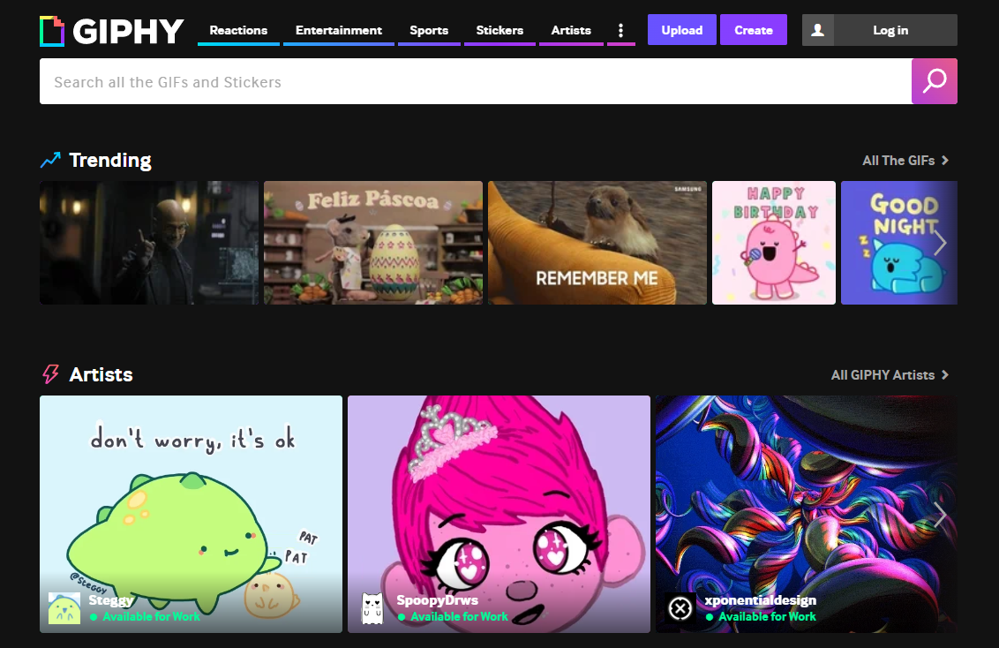
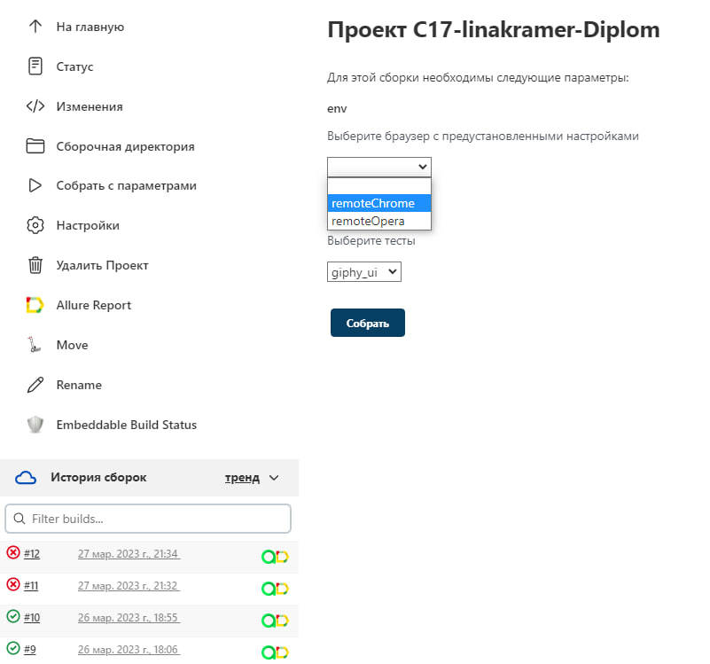
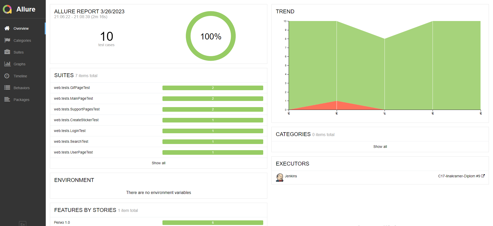
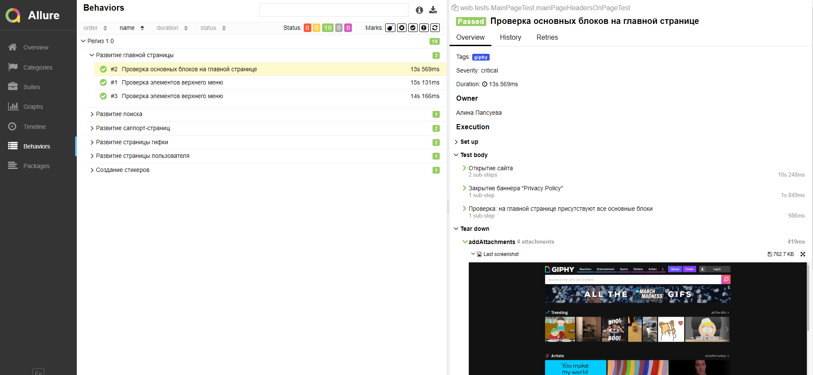
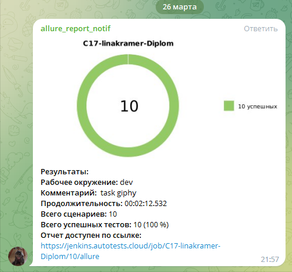
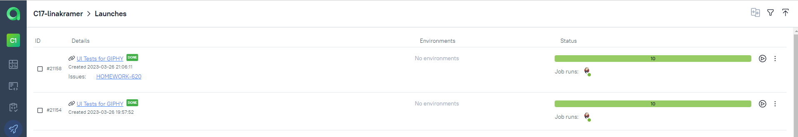
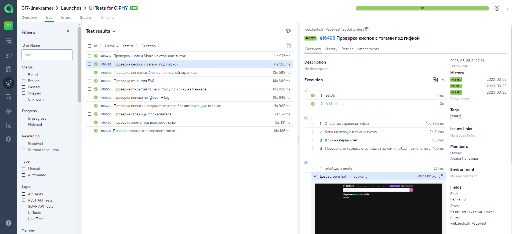
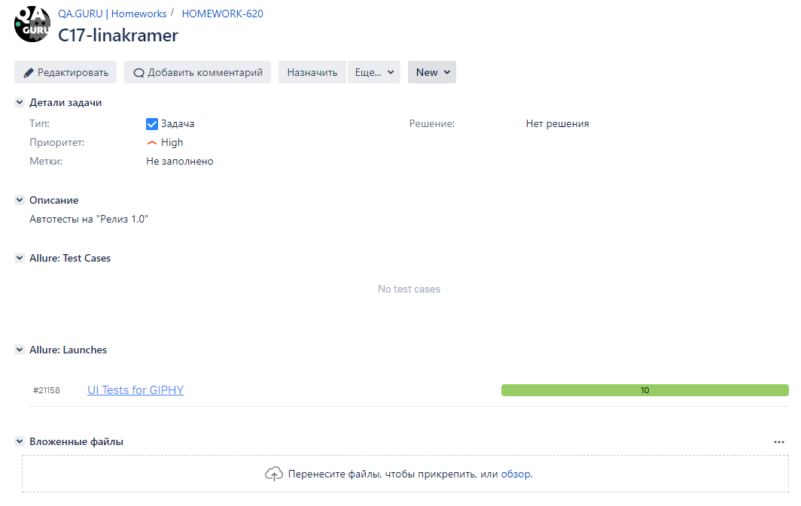
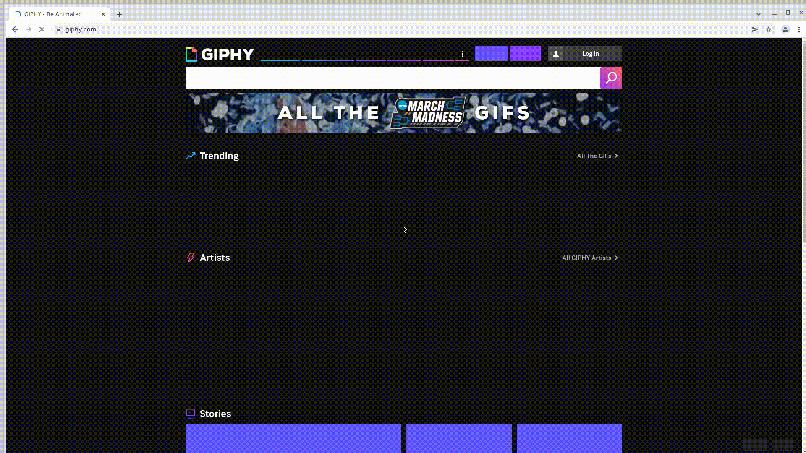

# UI и API автотесты для сайта [GIPHY](https://giphy.com/)



## :bookmark_tabs: <a id="list"></a> Содержание 

* <a href="#tools">Технологии и инструменты</a>

* <a href="#cases">Реализованные проверки</a>:   
  - <a href="#cases-ui"> UI
  - <a href="#cases-api"> API

* <a href="#integrations">Подключенные интеграции</a>

* <a href="#console">Запуск из терминала</a>
  - <a href="#console-ui"> UI
  - <a href="#console-api"> API

* <a href="#jenkins">Сборка в Jenkins</a>

* <a href="#allure">Allure отчеты</a>

* <a href="#telegram">Отчёт в Telegram</a>

* <a href="#testops">Интеграция с Allure TestOps</a>

* <a href="#jira">Интеграция с Jira</a>

* <a href="#video">Пример прогона теста в Selenoid</a>


## :hammer_and_wrench: <a id="tools"></a> Технологии и инструменты
<p align="center">
<a href="https://www.jetbrains.com/idea/"></a>
<a href="https://www.java.com/"></a>
<a href="https://github.com/"></a>
<a href="https://junit.org/junit5/"></a>
<a href="https://gradle.org/"></a>
<a href="https://selenide.org/"></a>
<a href="https://aerokube.com/selenoid/"></a>
<a href="https://github.com/allure-framework/allure2"></a>
<a href="https://qameta.io"></a>
<a href="https://www.jenkins.io/"></a>
<a href="https://telegram.org/"></a>
<a href="https://www.atlassian.com/ru/software/jira"></a>
</p>


## :white_check_mark: <a id="cases"></a> Реализованные проверки
<a id="cases-ui"></a>UI-кейсы:
  
:heavy_check_mark: Проверка создания стикера без авторизации на сайте   
:heavy_check_mark: Проверка кнопки Share на странице гифки   
:heavy_check_mark: Проверка кнопок с тэгами под гифкой   
:heavy_check_mark: Проверка логина с рандомными значениями   
:heavy_check_mark: Проверка элементов верхнего меню   
:heavy_check_mark: Проверка основных блоков на главной странице   
:heavy_check_mark: Проверка поиска по @user + tag   
:heavy_check_mark: Проверка открытия Privacy Policy по клику на баннере   
:heavy_check_mark: Проверка открытия FAQ   
:heavy_check_mark: Проверка страницы пользователя   
  
<a id="cases-api"></a>API-кейсы:
  
:heavy_check_mark: Поиск гифки по корректному ID   
:heavy_check_mark: Поиск гифки по НЕкорректному ID   
:heavy_check_mark: Поиск по слову "sticker"   
:heavy_check_mark: Ошибка 414 при количестве символов более 50 в поисковом запросе   
:heavy_check_mark: БАГ в API - Поиск без обязательного параметра "q"   
:heavy_check_mark: Поиск без обязательного параметра "api_key"   
:heavy_check_mark: Загрузка гифки   

<a href="#list">К Содержанию</a>

## :on:	<a id="integrations"></a> Подключенные интеграции
:heavy_check_mark: Запуск автотестов в Jenkins   
:heavy_check_mark: Allure Report + SelenideLogger.addListener + step()   
:heavy_check_mark: Уведомление от бота в Telegram с отчетом о прохождении тестов   
:heavy_check_mark: Allure TestOps   
:heavy_check_mark: Jira   
:heavy_check_mark: Selenoid   
:heavy_check_mark: Библиотека Owner   
:heavy_check_mark: Java Faker  
:heavy_check_mark: Assertj 

<a href="#list">К Содержанию</a>

## :desktop_computer: <a id="console"></a> Запуск из терминала
  
### <a id="console-ui"></a>Локальный запуск UI-тестов

```
gradle clean giphy_ui -Denv="{ENV}"
```
  В проекте созданы 3 файла properties для локального запуска с предустановленными настройками:
  * chrome    
  * edge    
  * opera    
  
  В параметр {ENV} необходимо вписать один из трёх файлов.

### <a id="console-api"></a>Локальный запуск API-тестов

```
gradle clean giphy_api
```
  
### Удаленный запуск тестов

```
clean
${test_run}
-Denv=${env}
```
  В проекте созданы 2 файла properties для удаленного запуска с предустановленными настройками:
  * remoteChrome     
  * remoteOpera  
  
> `${env}` - конфиг для быстрого выбора конфигурации запуска тестов.
> 
> `${test_run}` - название 

<a href="#list">К Содержанию</a>

## <a id="jenkins"></a>  Сборка в [Jenkins](https://jenkins.autotests.cloud/job/C17-linakramer-Diplom/)

:information_source: При сборке в Jenkins можно выбрать параметры из выпадающих списков   



<a href="#list">К Содержанию</a>

## <a id="allure"></a>  [Allure](https://jenkins.autotests.cloud/job/C17-linakramer-Diplom/10/allure/) отчеты

:information_source: По итогам сборки в Jenkins собирается отчет в Allure Report   
* Автотесты написаны как "шаги" через SelenideLogger.addListener + step() = описание пройденных тестов понятно любому сотруднику
* Подключено добавление в отчет:   
  - последнего скриншота
  - ресурсов страницы
  - логов браузера
  - видео прохождения тестов




<a href="#list">К Содержанию</a>

## <a id="telegram"></a>  Отчёт в Telegram
:information_source: Также отчет по сборке можно отправить в телеграм через бота



<a href="#list">К Содержанию</a>

## <a id="testops">  Интеграция с [Allure TestOps](https://allure.autotests.cloud/launch/21158)
:information_source: Настроена интеграция с Allure TestOps, в котором также можно увидеть отчет о прохождении автотестов
  



<a href="#list">К Содержанию</a>

## <a id="jira"></a>  Интеграция с [Jira](https://jira.autotests.cloud/browse/HOMEWORK-620)
:information_source: Настроена интеграция Allure TestOps с Jira.
Тест-кейсы и результаты прогонов можно прикреплять к необходимым задачам.
  


<a href="#list">К Содержанию</a>

## <a id="video"></a>  Пример прогона теста в Selenoid
:information_source: Видео прогона одного из кейсов. Записано автоматически.
  


<a href="#list">К Содержанию</a>
